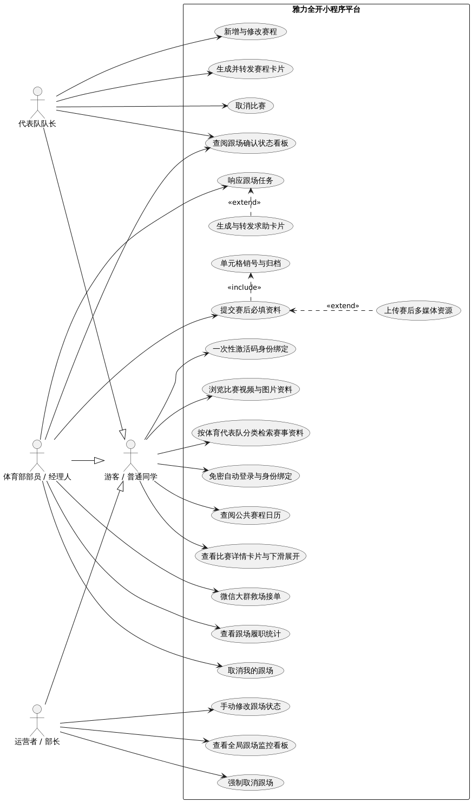

软件需求的用例模型

“雅力全开”小程序的用户分为四类：游客/普通同学（GuestUser）、代表队队长（TeamCaptain）、体育部部员/经理人（TeamManager） 以及 运营者/部长（Admin）。
四者之间存在继承关系：代表队队长、体育部部员和运营者首先是普通同学；运营者身份在后台绑定指定。用例间存在包含（include）和扩展（extend）关系，具体用例模型描述如下：

- 游客/普通同学可触发：免密登录、查阅公共赛程日历、浏览历史赛况与比分、查看跟场部员上传的现场照片与视频、按体育代表队栏目查找代表队全部比赛信息（历史赛况、照片等资料，未开始的比赛的信息）；
- 代表队队长（继承普通同学全部用例）额外可触发：新增/修改本队赛程（须填写时间、地点、跟场需求）、生成并转发微信赛程通知卡片、彻底取消比赛、查阅跟场确认状态看板；
- 体育部部员/经理人（继承普通同学全部用例）额外可触发：查看经理人历史跟场次数统计、响应微信赛程卡片（确认跟场/没空）、生成微信求助卡片、微信大群救场接单、取消我的跟场、赛后提交比分与胜负结果、赛后上传现场照片与视频、查阅跟场确认状态看板；
- 运营者/部长（继承普通同学全部用例）额外可触发：查看全局跟场监控看板、强制取消跟场（解除看板警报）、手动修改跟场状态；
- 新增/修改赛程包含根据规则重置跟场状态（若开赛前不足 48 小时修改则自动强制拉红，或勾选“时间待定”进入挂起状态）；
- 响应微信赛程卡片包含根据跟场结果更新看板状态、生成求助卡片（单人/多人全选“没空”或赛前 48 小时无人确认时，触发看板拉红警报）；
- 提交赛后必填资料包含单元格销号（提交比分与胜负结果后，该场比赛单元格彻底从小程序看板中销号删除，并将数据自动归档）；
- 赛后上传现场照片与视频扩展提交赛后必填资料（在提交比分与胜负结果的基础上，可选择性上传多媒体资源）。

具体用例描述

1. 免密自动登录与身份绑定（OpenIDLogin）
- 执行者：游客 / 普通同学、代表队队长、体育部部员 / 经理人、运营者 / 部长
- 描述：用户打开小程序，系统自动获取其微信 openid 进行身份静默校验。若为已绑定身份（如队长、部员、运营者），系统直接自动登录并载入对应权限的工作台；若为未绑定身份的新用户，则默认以游客身份进入系统，后续可随时选择进行一次性激活码绑定。
  
2. 一次性激活码身份绑定（BindIdentity）
- 执行者：代表队队长、体育部部员 / 经理人、运营者 / 部长
- 描述：未绑定的用户在个人中心输入体育部预先分发的“一次性激活码”，系统校验激活码有效性后，在后台将该用户的微信 openid 与对应的角色身份（队长/部员/运营者）进行永久绑定，并作废该激活码。绑定完成后用户即刻解锁专属管理权限，后续使用无需重复输入任何密钥或验证码。
  
3. 新增与修改赛程（ManageSchedule）
- 执行者：代表队队长
- 描述：队长录入比赛项目、对阵双方、时间、地点及勾选后勤需求。系统保存赛程，若修改时间和地点则自动清空原经理人确认状态重置为黄色；若临近开赛不足 48 小时修改则直接触发拉红警报，或勾选 时间待定 挂起。
  
4. 生成并转发赛程卡片（ShareScheduleCard）
- 执行者：代表队队长
- 描述：队长在赛程发布后一键生成标准的微信分享卡片，并将其转发至经理人私聊或专属微信群中，完成规范化赛事对接。
  
5. 取消比赛（CancelMatch）
- 执行者：代表队队长
- 描述：因对手退赛或赛事废止，队长在后台执行彻底取消比赛操作，该场比赛在日历与看板中标记为已取消，相关跟场流程自动终止。
  
6. 查看跟场履职统计（ViewHistoryStats）
- 执行者：体育部部员 / 经理人
- 描述：经理人进入响应页面顶部，直观查看本队所有经理人的历史跟场次数统计数据，作为内部调配的依据。
  
7. 响应跟场任务（RespondSchedule）
- 执行者：体育部部员 / 经理人
- 描述：经理人点击微信赛程卡片进入系统，选择【确认跟场】使看板变绿；或选择【没空】。系统根据单人或多人队伍表态逻辑实时更新单元格状态（待确认/已确认/求助中）。
  
8. 生成与转发求助卡片（GenerateHelpCard）
- 执行者：体育部部员 / 经理人
- 描述：当多经理人均选择“没空”或赛前 48 小时无人确认导致看板拉红时，最后一位经理人生成微信求助卡片，必须将其转发至体育部微信大群并向部长报备。
  
9. 微信大群救场接单（GroupRescue）
- 执行者：体育部部员 / 经理人
- 描述：其他部员在看板看到红色单元格后，需等待责任经理人将求助卡片发到大群，部员点击群内求助卡片弹出的页面点击【我来救场/确认接单】完成救场。
  
10. 取消我的跟场（CancelMyDuty）
- 执行者：体育部部员 / 经理人
- 描述：经理人主动取消已确认的跟场名额，使看板回退为黄色待确认状态交由他人协商；若距开赛不足 48 小时取消，系统弹窗强提醒确认已落实替换人员并报备。
  
11. 提交赛后必填资料（SubmitPostMatchData）
- 执行者：体育部部员 / 经理人
- 描述：比赛到达预定结束时间看板单元格转为橙色，跟场部员必须登录填写比分与胜负结果，不填写无法提交，提交后单元格彻底从小程序看板中销号删除。
  
12. 上传赛后多媒体资源（UploadMedia）
- 执行者：体育部部员 / 经理人（扩展）
- 描述：跟场部员在提交赛后比分与胜负结果的同时，可选择性上传比赛现场照片与视频等多媒体资源，丰富赛事档案。
  
13. 查看全局跟场监控看板（ViewDashboard）
- 执行者：运营者 / 部长
- 描述：部长登录运营者账号，通过直观的二维四色看板（黄/绿/红/橙）实时透视全院所有代表队的跟场与归档动态，无需逐一私聊询问。
  
14. 强制取消跟场（ForceCancelDuty）
- 执行者：运营者 / 部长
- 描述：当代表队比赛因故无需跟场且求助无果时，部长在看板找到对应比赛直接点击强制取消，解除红色警报并恢复看板正常状态。
  
15. 手动修改跟场状态（ManualResetStatus）
- 执行者：运营者 / 部长
- 描述：在异常情况下，部长通过后台手动重置、调整或指定具体的跟场人员，兜底解决突发的人员调度混乱问题。

16. 查阅公共赛程日历（ViewCalendar）
- 执行者：游客 / 普通同学
- 描述：用户可在小程序首页或赛程页面以日历形式查阅全院所有代表队已发布的公共赛程，直观查看每日比赛时间、对阵双方及比赛地点。
  
17. 查看比赛详情卡片与下滑展开（ViewMatchDetailCard）
- 执行者：游客 / 普通同学
- 描述：用户在赛程列表中点击任意比赛卡片，可下滑展开查看该场比赛的详细信息，包括双方队伍、比赛时间地点、后勤需求备注、当前跟场确认状态以及实时/赛后比分。
  
18. 浏览比赛视频与图片资料（ViewMatchMedia）
- 执行者：游客 / 普通同学
- 描述：用户可在线播放和查看跟场部员赛后上传的现场精彩视频与比赛图片，直观了解院系代表队的现场赛况与风采。
  
19. 按体育代表队分类检索赛事资料（BrowseByTeam）
- 执行者：游客 / 普通同学
- 描述：用户可进入代表队专属栏目（如排球队、足球队、篮球队等），分类筛选并检索特定队伍的全部比赛资料，包括历史赛况回顾、实时比分、现场影音资源以及未开始的赛程计划。

软件需求的分析模型

对于软件需求用例逐个分析业务流程，阐述清楚功能的业务逻辑。

本小程序基于微信云开发架构实现，采用经典的「界面类—控制类—实体类」三层结构对每个用例的业务逻辑进行描述：

- 界面类（Boundary）：小程序前端页面（Page）与复用组件（Component），负责数据展示与用户交互，如 HomePage（首页赛程日历）、DashboardPage（四色跟场看板，仅对已绑定身份的队长/部员/运营者可见，游客不可见）、RespondPage（跟场响应页）、ScheduleFormPage（赛程录入页）等；
- 控制类（Control）：微信云函数（Cloud Function），负责业务逻辑处理、权限校验与状态机流转，如 AuthManager（身份认证）、ScheduleManager（赛程管理）、DutyManager（跟场任务）、ArchiveManager（赛后归档）等；
- 实体类（Entity）：云数据库集合（Collection）与云存储，负责数据持久化，如 MatchCollection（比赛赛程表）、DutyRecordCollection（跟场响应记录表）、ArchiveCollection（赛后归档表）、UserCollection（用户身份表）、ActivationCodeCollection（激活码表）等。

前端页面通过 wx.cloud.callFunction() 调用控制类云函数；云函数之间可互相调用（如 TimerChecker 定时触发器云函数负责赛前 48 小时拉红巡检与到点转橙巡检）；媒体资源以清华云盘链接形式存储于归档记录中，游客可直接点击查看。以下对全部 19 个用例逐一展开分析。

用例 1：免密自动登录与身份绑定（OpenIDLogin）

1.用户打开小程序，前端启动逻辑调用微信授权接口静默获取用户标识，首页 HomePage 向控制类 AuthManager 发送 autoLogin() 请求，携带 openid；
2.控制类 AuthManager 接收到请求后，调用 UserCollection 实体的 queryUserByOpenId() 方法，查询该 openid 是否已绑定身份（队长/部员/运营者）；
3.若已绑定，AuthManager 依据 UserCollection 中的 role 字段返回身份与权限信息，前端载入对应角色的工作台（如游客进入公开首页，队长显示赛程管理入口，运营者显示看板管理按钮）；
4.若未绑定，AuthManager 返回游客身份，前端以游客模式进入 HomePage 与 TeamColumnPage，仅开放公开信息的只读权限，TabBar 中不展示「看板」Tab；
5.绑定身份的用户后续每次打开小程序均自动完成上述静默校验，无需重复输入任何密钥。

图 1：免密自动登录用例分析图

用例 2：一次性激活码身份绑定（BindIdentity）

1.未绑定身份的用户进入个人中心界面 ProfilePage，输入体育部预先分发的「一次性激活码」，点击「绑定」按钮，向控制类 AuthManager 发送 bindIdentity() 请求，携带 openid 与激活码；
2.控制类 AuthManager 接收到请求后，调用 ActivationCodeCollection 实体的 queryCode() 方法，校验激活码是否存在且未使用，返回校验结果；
3.若激活码无效（不存在或已被使用），AuthManager 将失败原因返回至 ProfilePage，界面向用户展示错误提示；
4.若激活码有效，AuthManager 调用 UserCollection 的 createUser() 方法，将该用户的 openid 与激活码对应的角色身份（队长/部员/运营者，队长身份同时关联具体代表队）永久绑定并存储；
5.AuthManager 随即调用 ActivationCodeCollection 的 invalidateCode() 方法作废该激活码，保证一次性使用；绑定成功结果返回 ProfilePage，界面提示绑定完成并刷新权限，解锁对应角色的专属功能（如看板 Tab、赛程管理入口）。

图 2：激活码身份绑定用例分析图

用例 3：新增与修改赛程（ManageSchedule）

1.队长进入赛程录入界面 ScheduleFormPage，填写比赛项目、对阵双方、比赛时间、地点并勾选后勤需求（饮用水、记分、摄影等），点击「发布」或「保存修改」按钮，向控制类 ScheduleManager 发送 saveMatch() 请求，携带完整赛程信息；
2.控制类 ScheduleManager 接收到请求后，先调用 AuthManager 校验请求者角色是否为该代表队队长，再调用 MatchCollection 实体的 saveMatch() 方法存储/更新赛程记录；
3.若为新增赛程，MatchCollection 初始单元格状态为黄色（待确认），等待经理人响应；若队长勾选「时间待定（TBD）」，状态置为灰色（挂起），暂停所有倒计时与拉红机制；
4.若为修改已发布赛程的时间或地点，ScheduleManager 调用 DutyRecordCollection 的 clearConfirmations() 方法，强制清空原经理人的确认记录，将单元格重置为黄色，确保变更被双向锁定；
5.若修改时距新开赛时间不足 48 小时，ScheduleManager 跳过黄色阶段，直接将单元格置为红色（紧急警报）；若仅修改后勤需求，不触发状态重置，前端弹出强提醒：「变更后勤需求可能无法及时通知跟场部员，请务必私聊告知跟场部员」；
6.ScheduleManager 将保存结果与新状态返回 ScheduleFormPage，界面提示发布成功，看板与日历同步刷新。

图 3：新增与修改赛程用例分析图

用例 4：生成并转发赛程卡片（ShareScheduleCard）

1.队长在赛程管理界面点击「转发给经理人」按钮，前端调用微信分享接口，向控制类 ScheduleManager 发送 getShareCard() 请求，携带比赛 ID；
2.控制类 ScheduleManager 调用 MatchCollection 实体的 queryMatchById() 方法获取该场比赛的完整信息（项目、对阵、时间、地点、后勤需求）；
3.ScheduleManager 将比赛信息格式化为标准卡片标题与摘要，并携带 matchId 参数生成卡片跳转路径（直达 RespondPage），返回至前端；
4.前端唤起微信分享面板，生成标准赛程通知卡片，队长选择经理人私聊或专属微信群发送，完成规范化对接；
5.经理人后续点击卡片时，小程序依据 matchId 参数直接定位到该场比赛的 RespondPage 响应页。

图 4：生成并转发赛程卡片用例分析图

用例 5：取消比赛（CancelMatch）

1.队长因对手退赛或赛事废止，在赛程管理界面点击「取消比赛」按钮，向控制类 ScheduleManager 发送 cancelMatch() 请求，携带比赛 ID；
2.控制类 ScheduleManager 校验队长身份后，调用 MatchCollection 实体的 updateStatus() 方法，将该场比赛标记为「已取消」；
3.ScheduleManager 联动调用 DutyRecordCollection 的 terminateDuties() 方法，自动终止该场比赛相关的全部跟场流程（清除确认记录与求助状态）；
4.该场比赛在公共日历与四色看板上直接标记为「已取消」，单元格不再参与状态机流转与 48 小时巡检；
5.ScheduleManager 将取消结果返回前端，界面提示取消成功，相关经理人在打开对应页面时看到已取消标记。

图 5：取消比赛用例分析图

用例 6：查看跟场履职统计（ViewHistoryStats）

1.经理人点击微信赛程卡片进入响应页 RespondPage，页面向控制类 DutyManager 发送 getTeamStats() 请求，携带代表队 ID；
2.控制类 DutyManager 接收到请求后，调用 DutyRecordCollection 实体的 countByManager() 方法，对本队所有经理人的历史有效跟场记录（含救场接单）按人聚合计数；
3.DutyRecordCollection 返回各经理人的跟场次数数据，DutyManager 格式化为统计列表（如「经理人A：4 次，经理人B：1 次」）返回 RespondPage；
4.RespondPage 在页面顶部直观展示本队全部经理人的履职数据，通过数据完全公开约束「装死」行为，作为经理人内部线下沟通调配的依据；
5.统计随每次跟场记录的确认/归档实时更新，所有本队部员看到的统计数据一致。

图 6：查看跟场履职统计用例分析图

用例 7：响应跟场任务（RespondSchedule）

1.经理人点击微信赛程卡片，小程序依据卡片携带的 matchId 直达响应页 RespondPage；页面顶部展示队长录入的完整比赛信息（项目、对阵、时间、地点、后勤需求）及本队经理人历史跟场统计，下方提供「确认跟场」「没空」按钮；
2.经理人点击「确认跟场」，RespondPage 向控制类 DutyManager 发送 confirmDuty() 请求，携带比赛 ID 与经理人身份；
3.控制类 DutyManager 调用 DutyRecordCollection 实体的 addConfirmation() 方法记录本次确认，并调用 MatchCollection 的 updateCellStatus() 方法刷新单元格状态：只要有 1 位经理人（或救场部员）确认，看板立即变绿；
4.若经理人点击「没空」，RespondPage 向 DutyManager 发送 declineDuty() 请求；DutyManager 按队伍人数分流处理：单经理人队伍立即置红并解锁求助卡片生成；多经理人队伍只要还有人未表态，保持黄色，当最后一位经理人也选择「没空」时，才置红并解锁求助卡片；
5.DutyManager 将最新单元格状态返回 RespondPage，界面展示响应结果；前端同步刷新 DashboardPage 的对应单元格颜色。

图 7：响应跟场任务用例分析图

用例 8：生成与转发求助卡片（GenerateHelpCard）

1.当多经理人全员选择「没空」（最后一位点击的经理人作为第一责任人），或赛前 48 小时无人确认导致看板拉红时，责任经理人在响应页 RespondPage 点击「生成求助卡片」按钮，向控制类 DutyManager 发送 generateHelpCard() 请求，携带比赛 ID；
2.控制类 DutyManager 校验单元格确为红色状态后，调用 MatchCollection 实体的 getMatchInfo() 方法获取比赛完整信息；
3.DutyManager 将比赛信息、求助原因格式化为求助卡片内容，携带 matchId 生成卡片跳转路径（直达 RescuePage 救场接单页），返回 RespondPage；
4.前端唤起微信分享面板生成求助卡片，第一责任人必须将其转发至体育部微信大群，并私聊向部长报备；
5.其他部员无法在 DashboardPage 上直接点击红色单元格接单，必须点击大群里的求助卡片进入 RescuePage 才能救场，确保所有救场行为在微信群内公开对齐。

图 8：生成与转发求助卡片用例分析图

用例 9：微信大群救场接单（GroupRescue）

1.其他部员在体育部大群点击求助卡片，小程序依据 matchId 直达救场接单页 RescuePage；页面顶部展示该场比赛的完整信息（项目、对阵、时间、地点、后勤需求）与求助原因；
2.部员点击「我来救场/确认接单」按钮，RescuePage 向控制类 DutyManager 发送 rescueDuty() 请求，携带比赛 ID 与部员身份；
3.控制类 DutyManager 校验该部员具备部员身份、且单元格仍为红色（求助中）后，调用 DutyRecordCollection 实体的 addRescue() 方法记录救场接单；
4.DutyManager 调用 MatchCollection 的 updateCellStatus() 方法，将单元格由红色置为绿色，跟场人更新为救场部员；
5.DutyManager 将接单结果返回 RescuePage，界面提示救场成功；DashboardPage 对应单元格变绿，本次救场计入该部员的历史跟场统计。

图 9：微信大群救场接单用例分析图

用例 10：取消我的跟场（CancelMyDuty）

1.已确认跟场的经理人（含救场部员）在比赛详情卡片或响应页点击「取消我的跟场」按钮，向控制类 DutyManager 发送 cancelMyDuty() 请求，携带比赛 ID 与本人身份；
2.控制类 DutyManager 调用 MatchCollection 实体的 getMatchById() 方法检查距开赛时间是否不足 48 小时；
3.若不足 48 小时，DutyManager 返回安全锁标记，前端弹窗强提醒：「距比赛开始不足48小时，取消后请务必确认已落实其他替换部员，并私聊部长报备！」，用户需二次确认方可继续；
4.确认后，DutyManager 调用 DutyRecordCollection 的 removeConfirmation() 方法释放该名额，并调用 MatchCollection 的 updateCellStatus() 方法将单元格回退为黄色（待确认），交由群内协商替换；
5.协商好的新经理人点开该比赛点击「确认跟场」（流程同用例 7），看板重新变绿，跟场人更新；此机制用于避免积极同学总是承担任务、工作压力过大。

图 10：取消我的跟场用例分析图

用例 11：提交赛后必填资料（SubmitPostMatchData）

1.到达比赛预定结束时间的瞬间，定时触发器云函数 TimerChecker 调用 MatchCollection 实体的 updateStatus() 方法，将该场比赛单元格置为橙色（待结算），提醒跟场部员立即填写赛事资料；
2.跟场部员进入赛后归档页 ArchiveFormPage（可由橙色单元格点击进入），页面顶部展示比赛信息，下方提供比分与胜负结果的必填文本框（自定义格式，写清晰即可）与云盘链接选填框；
3.部员填写完毕点击「提交归档」，ArchiveFormPage 向控制类 ArchiveManager 发送 submitArchive() 请求，携带比赛 ID、比分、胜负结果与云盘链接；
4.控制类 ArchiveManager 校验必填项：若比分或胜负结果为空，返回校验失败，ArchiveFormPage 提示「必填项未填写，无法提交」；
5.校验通过后，ArchiveManager 调用 ArchiveCollection 实体的 createArchive() 方法将比赛数据归档存储，并调用 MatchCollection 的 closeCell() 方法执行单元格销号——该场比赛单元格彻底从 DashboardPage 看板上删除；
6.ArchiveManager 返回归档成功结果，ArchiveFormPage 提示提交完成，比赛数据自动进入公开的「赛事回顾」公共大厅，游客可在日历与队伍栏目中浏览该场赛况与比分。

图 11：提交赛后必填资料用例分析图

用例 12：上传赛后多媒体资源（UploadMedia）

1.本用例扩展用例 11：跟场部员在 ArchiveFormPage 提交比分与胜负结果的同时，可在「现场资料云盘链接」选填框中粘贴一条清华云盘汇总链接（照片与视频统一整理于云盘文件夹）；
2.部员点击「提交归档」，ArchiveFormPage 向控制类 ArchiveManager 发送 submitArchive() 请求时携带云盘链接字段（可为空）；
3.控制类 ArchiveManager 将云盘链接与比分、胜负结果一并写入 ArchiveCollection 实体的归档记录，不强制校验链接内容，没拍或无资源可留空；
4.归档成功后，该云盘链接展示在公共比赛详情卡片 MatchDetailCard 的媒体区域，游客点击链接即可直接查看现场照片与视频；
5.开发后期再评估是否将本用例升级为通过 wx.cloud 上传媒体文件至云存储的直传方案，当前版本统一走云盘链接以降低实现成本。

图 12：上传赛后多媒体资源用例分析图

用例 13：查看全局跟场监控看板（ViewDashboard）

1.已绑定身份的队长/部员/运营者点击 TabBar「看板」，进入 DashboardPage，页面向控制类 DashboardManager 发送 getDashboard() 请求，携带用户身份；未绑定身份的游客 TabBar 中不展示「看板」Tab，无访问权限；
2.控制类 DashboardManager 调用 MatchCollection 实体的 queryActiveMatches() 方法，查询全部代表队未销号的比赛，及 DutyRecordCollection 中对应的跟场确认记录；
3.DashboardManager 将数据组装为二维看板（纵轴为体育代表队，横轴为按时间排列的比赛场次）返回 DashboardPage，单元格按状态机渲染四色：黄色（待确认）、绿色（已确认）、红色（求助中）、橙色（待结算），灰色为时间待定挂起，已取消比赛标记删除线；
4.任何已绑定用户点击单元格，下滑展开共用组件 MatchDetailCard，查看具体状态详情（如「待确认」「部员XXX已确认」「求助中，待大群救场」）及比赛完整信息；
5.仅当请求者角色为运营者时，DashboardManager 在返回数据中附带管理权限标记，DashboardPage 在卡片上额外渲染「强制取消跟场」「手动修改跟场状态」按钮；队长与部员视图为只读。

图 13：查看全局跟场监控看板用例分析图

用例 14：强制取消跟场（ForceCancelDuty）

1.当某场比赛求助无果、经部长与队长沟通确认本场无需跟场（如普通练习赛）后，运营者在 DashboardPage 找到该红色单元格，下滑展开 MatchDetailCard，点击「强制取消跟场」按钮，向控制类 DashboardManager 发送 forceCancelDuty() 请求，携带比赛 ID；
2.控制类 DashboardManager 校验请求者角色为运营者，通过后调用 DutyRecordCollection 实体的 terminateDuties() 方法清除该场比赛全部跟场与求助记录；
3.DashboardManager 调用 MatchCollection 的 updateStatus() 方法，将该场比赛标记为「跟场已取消」，解除红色警报；
4.该单元格在看板上恢复正常显示（置灰标记，不再触发 48 小时巡检与求助流程），防止无效警报残留；
5.DashboardManager 返回处理结果，DashboardPage 刷新对应单元格，闭环处理完成。

图 14：强制取消跟场用例分析图

用例 15：手动修改跟场状态（ManualResetStatus）

1.出现人员调度混乱等异常情况时，运营者在 DashboardPage 找到对应单元格，下滑展开 MatchDetailCard，点击「手动修改跟场状态」按钮，前端弹出状态修改面板（重置为黄色 / 直接指派跟场人）；
2.运营者选择目标操作并提交，DashboardPage 向控制类 DashboardManager 发送 manualResetStatus() 请求，携带比赛 ID、目标状态与（可选）指派部员；
3.控制类 DashboardManager 校验运营者身份后，调用 MatchCollection 实体的 updateCellStatus() 方法强制写入目标单元格状态；
4.若为指派跟场人，DashboardManager 联动调用 DutyRecordCollection 的 addConfirmation() 方法，以指派记录的形式写入该部员的跟场确认，看板置绿且跟场人更新为指定部员；
5.DashboardManager 返回修改结果，DashboardPage 刷新展示；该操作作为兜底手段，解决突发的人员调度混乱问题，操作记录留痕可追溯。

图 15：手动修改跟场状态用例分析图

用例 16：查阅公共赛程日历（ViewCalendar）

1.用户（含游客）打开小程序进入首页 HomePage，页面向控制类 CalendarManager 发送 getCalendar() 请求，携带日期范围（默认当日及后续，可切换月份）；
2.控制类 CalendarManager 接收到请求后，调用 MatchCollection 实体的 queryPublishedMatches() 方法，按时间范围查询全部已发布且未取消的比赛（含未开始与已归档）；
3.MatchCollection 返回比赛列表数据，CalendarManager 格式化处理后返回 HomePage；
4.HomePage 以日历视图与比赛卡片列表展示每日比赛的时间、对阵双方与地点；用户点击任意比赛卡片，下滑展开共用组件 MatchDetailCard 查看详情（同用例 17）；
5.无需任何身份校验，全公开只读；绑定身份的用户在同一首页看到的内容与游客一致，管理入口位于各自专属页面。

图 16：查阅公共赛程日历用例分析图

用例 17：查看比赛详情卡片与下滑展开（ViewMatchDetailCard）

1.用户在首页日历列表或队伍栏目中点击任意比赛卡片，前端触发下滑展开动画，向控制类 CalendarManager 发送 getMatchDetail() 请求，携带比赛 ID；
2.控制类 CalendarManager 调用 MatchCollection 实体的 queryMatchById() 方法获取比赛基础信息（双方队伍、时间地点、后勤需求备注、当前跟场确认状态）；
3.若该场比赛已归档，CalendarManager 进一步调用 ArchiveCollection 实体的 queryArchiveByMatch() 方法获取赛后比分、胜负结果与云盘媒体链接；
4.CalendarManager 将完整数据返回前端，MatchDetailCard 组件展示：未开始比赛显示跟场状态（该信息对游客脱敏为「已确认/待确认」），已结束比赛显示最终比分与胜负及媒体链接入口；
5.用户点击云盘链接可跳转查看现场照片与视频（同用例 18）；本卡片组件在首页、队伍栏目、看板三处复用，仅按角色与场景追加操作按钮。

图 17：查看比赛详情卡片用例分析图

用例 18：浏览比赛视频与图片资料（ViewMatchMedia）

1.用户在比赛详情卡片 MatchDetailCard 中点击媒体链接区域，前端向控制类 CalendarManager 发送 getMediaLink() 请求，携带比赛 ID；
2.控制类 CalendarManager 调用 ArchiveCollection 实体的 queryArchiveByMatch() 方法，取出该场比赛归档记录中的清华云盘汇总链接；
3.若归档记录含云盘链接，CalendarManager 返回链接，前端展示媒体入口，用户点击后跳转云盘页面在线查看现场照片与视频；
4.若该场比赛未归档或未填写云盘链接，CalendarManager 返回空标记，界面展示「暂无媒体资料」；
5.全过程对游客完全开放，无需登录绑定，直观了解院系代表队的现场赛况与风采。

图 18：浏览比赛视频与图片资料用例分析图

用例 19：按体育代表队分类检索赛事资料（BrowseByTeam）

1.用户（含游客）点击 TabBar「队伍」进入代表队栏目页 TeamColumnPage，页面向控制类 TeamManager 发送 getTeamList() 请求，获取全部代表队（排球、足球、篮球等）列表；
2.用户点选某一代表队栏目，TeamColumnPage 向 TeamManager 发送 getTeamMatches() 请求，携带代表队 ID；
3.控制类 TeamManager 调用 MatchCollection 实体的 queryMatchesByTeam() 方法，检索该队伍的全部比赛记录，并按状态分类：未开始的赛程计划、已归档的历史赛况；
4.对已归档比赛，TeamManager 联动调用 ArchiveCollection 的 queryArchivesByTeam() 方法，取出比分、胜负结果与云盘媒体链接一并返回；
5.TeamColumnPage 以列表展示该队伍全部比赛资料，用户点击任意比赛卡片下滑展开 MatchDetailCard 查看历史赛况回顾、实时/赛后比分、现场影音资源及未开始的赛程计划；队伍队长进入本队栏目时，额外显示赛程管理入口（跳转 ScheduleFormPage）。
